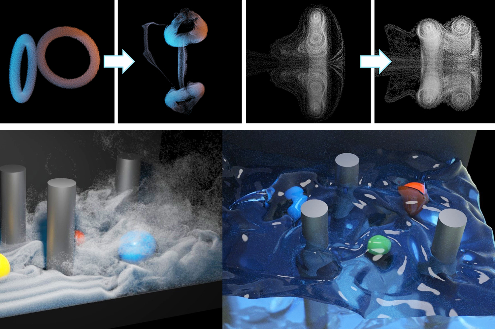
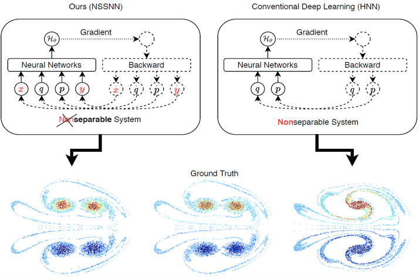

---
title: Shuqi Yang
--- 

# Shuqi Yang
**Email**: shuqi.yang.gr@dartmouth.edu; shuqi.yang.98@gmail.com

## About Me
I am second-year Master's student at Dartmouth College, advised by Prof. Bo Zhu. My research interests mainly focus on physical simulation and machine learning.   
Before this, I studied for my B.Eng. degree at Dalian University of Technology.

## Publications

<!--  -->

**Clebsch Gauge Fluid**  
ACM Transactions on Graphics (SIGGRAPH 2021)  
**Shuqi Yang**, Shiying Xiong, Yaorui Zhang, Fan Feng, Jinyuan Liu, Bo Zhu   
[[paper](https://www.cs.dartmouth.edu/~bozhu/papers/clebsch_gauge_fluid.pdf)] [<a href="https://y-sq.github.io/proj/clebsch_gauge_fluid/res/code.zip" download="code.zip">code</a>] [[video](https://www.youtube.com/watch?v=QF_XGzrJfa8)] [[webpage](https://y-sq.github.io/proj/clebsch_gauge_fluid/)]

<!--  -->

**Nonseparable Symplectic Neural Networks**  
International Conference on Learning Representations (ICLR 2021)  
Shiying Xiong, Yunjin Tong, Xingzhe He, **Shuqi Yang**, Cheng Yang, Bo Zhu  
[[paper](https://arxiv.org/pdf/2010.12636.pdf)] [[supplementary](https://openreview.net/attachment?id=B5VvQrI49Pa&name=supplementary_material)][[webpage](https://shiyingxiong.github.io/proj/NSSNN/NSSNN)]

<!--  -->

**Soft Multicopter Control using Neural Dynamics Identification**  
Conference on Robot Learning (CoRL 2020)  
Yitong Deng, Yaorui Zhang, Xingzhe He, **Shuqi Yang**, Yunjin Tong, Michael Zhang, Daniel M. DiPietro, Bo Zhu    
[[paper](https://arxiv.org/pdf/2008.07689.pdf)] [[video](https://www.youtube.com/watch?v=DjQq3i53W8k)] [[presentation](https://corlconf.github.io/paper_396/)]

<!--  -->

**Learning Physical Constraints with Neural Projections**  
Neural Information Processing Systems (NeurIPS 2020)  
**Shuqi Yang**, Xingzhe He, Bo Zhu  
[[paper](https://arxiv.org/abs/2006.12745)] [[code](https://github.com/y-sq/neural_proj)] [[webpage](https://y-sq.github.io/proj/neural_proj/)]
