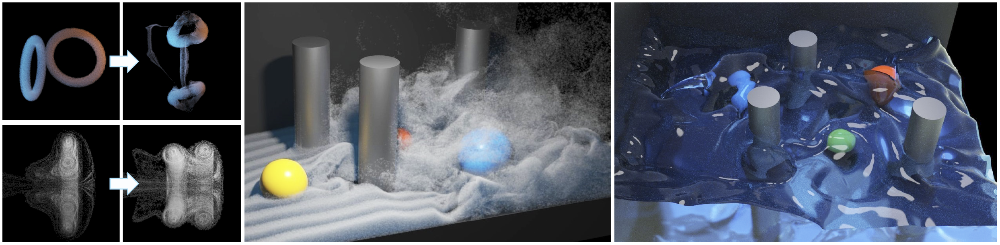

---
title: Clebsch Gauge Fluid
--- 

# Clebsch Gauge Fluid

[Shuqi Yang<sup>1</sup>](https://y-sq.github.io/), Shiying Xiong<sup>1</sup>, Yaorui Zhang<sup>1</sup>, Fan Feng<sup>1</sup>, Jinyuan Liu<sup>1</sup>, and [Bo Zhu<sup>1</sup>](https://www.cs.dartmouth.edu/~bozhu/)  
<sup>1</sup>Dartmouth College



## Paper 
**Clebsch Gauge Fluid**  
ACM Transactions on Graphics (SIGGRAPH 2021)  
[Shuqi Yang<sup>1</sup>](https://y-sq.github.io/), Shiying Xiong<sup>1</sup>, Yaorui Zhang<sup>1</sup>, Fan Feng<sup>1</sup>, Jinyuan Liu<sup>1</sup>, and [Bo Zhu<sup>1</sup>](https://www.cs.dartmouth.edu/~bozhu/)  
[paper] **[<a href="res/code.zip" download="code.zip">code</a>]**  **[[website](https://y-sq.github.io/proj/clebsch_gauge_fluid/)]**

## Video / Results
<video src="res/video.mp4" controls="controls" width="100%">Video</video>

## Citation
```
@inproceedings{yang2021clebsch,
  title={Clebsch Gauge Fluid},
  author={Yang, Shuqi and Xiong, Shiying and Zhang, Yaorui and Feng, Fan and Liu, Jinyuan and Zhu, Bo},
  booktitle={ACM SIGGRAPH 2021},
  year={2021}
}
```
