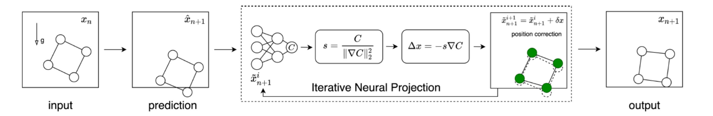

---
title: Learning Physical Constraints with Neural Projections
--- 

# Learning Physical Constraints with Neural Projections

[Shuqi Yang<sup>1</sup>](https://y-sq.github.io/), [Xingzhe He<sup>1</sup>](https://xingzhehe.github.io/), and [Bo Zhu<sup>1</sup>](https://www.cs.dartmouth.edu/~bozhu/)  
<sup>1</sup>Dartmouth College



## Paper 
**Learning Physical Constraints with Neural Projections**  
Neural Information Processing Systems (NeurIPS 2020)  
[Shuqi Yang](https://y-sq.github.io/), [Xingzhe He](https://xingzhehe.github.io/), and [Bo Zhu](https://www.cs.dartmouth.edu/~bozhu/)  
**[[paper](https://arxiv.org/abs/2006.12745)]** **[[code](https://github.com/y-sq/neural_proj)]**  **[[webpage](https://y-sq.github.io/proj/neural_proj/)]**  

## Abstract
We propose a new family of neural networks to predict the behaviors of physical systems by learning their underpinning constraints. A neural projection operator lies at the heart of our approach, composed of a lightweight network with an embedded recursive architecture that interactively enforces learned underpinning constraints and predicts the various governed behaviors of different physical systems. Our neural projection operator is motivated by the position-based dynamics model that has been used widely in game and visual effects industries to unify the various fast physics simulators. Our method can automatically and effectively uncover a broad range of constraints from observation point data, such as length, angle, bending, collision, boundary effects, and their arbitrary combinations, without any connectivity priors. We provide a multi-group point representation in conjunction with a configurable network connection mechanism to incorporate prior inputs for processing complex physical systems. We demonstrated the efficacy of our approach by learning a set of challenging physical systems all in a unified and simple fashion including: rigid bodies with complex geometries, ropes with varying length and bending, articulated soft and rigid bodies, and multi-object collisions with complex boundaries.

## Video / Results
<video src="https://www.cs.dartmouth.edu/~bozhu/videos/neural_projection.mp4" controls="controls" width="100%">Video: https://www.cs.dartmouth.edu/~bozhu/videos/neural_projection.mp4</video>


## Citation
```
@inproceedings{yang2020learning,
  title={Learning Physical Constraints with Neural Projections},
  author={Yang, Shuqi and He, Xingzhe and Zhu, Bo},
  booktitle = {Advances in Neural Information Processing Systems},
  year={2020}
}
```
